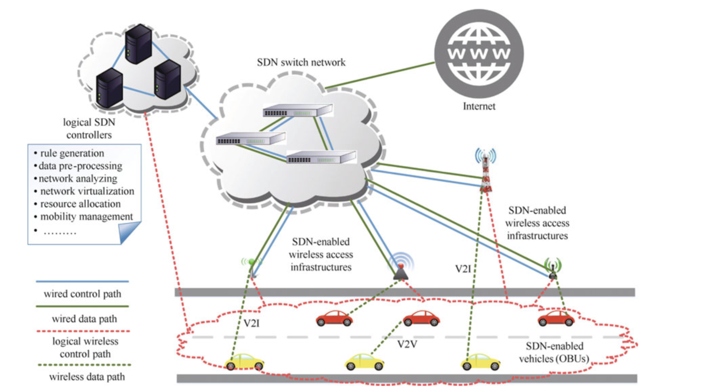

## 产业链

上游：主要包括RFID/传感器、定位芯片和其他硬件等元器件设备制造商。

　　中游：主要包括终端设备制造商、汽车生产商和软件开发商。

　　下游：主要包括TSP、系统集成商、内容服务提供商和移动通信运营商。

　　车联网产业链条长，产业角色丰富，从上游到下游涵盖制造业和服务业两大领域。制造业中整车厂作为核心位置，一方面作为终端、软件、服务的集成者，具有较大的话语权，同时也在开展自身的车载智能信息服务业务。通信芯片和通信模组由于涉及通信技术，门槛较高，主要参与者都是华为、大唐、中兴以及国外的高通、英特尔等通信行业领先企业。服务领域，通信运营商以中国移动、中国联通和中国电信为主，同时运营商也在积极拓展其他车联网领域业务。车联网信息服务提供商方面，包含了传统TSP供应商如安吉星等、主机厂自有TSP平台以及新兴车联网创业企业。从整个产业链条看，初创型企业更多的集中在车载终端设备、交通基础设备、软件开发、信息和内容服务等市场刚刚起步或者门槛较低的环节。

## 架构

Source:   Jiacheng, C., Haibo, Z., Ning, Z. et al. J. Commun. Inf. Netw. (2016) 1: 14. https://doi.org/10.1007/BF03391543
