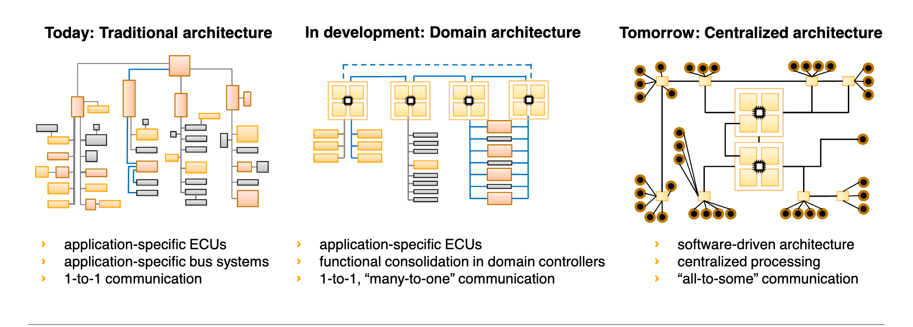

## 趋势

据麦肯锡预测 
下列四个堆栈会成为今后五到十年内新一代汽车的基础：

时间驱动栈。 控制器直接与传感器或执行器相连，而系统则需要支持严格的实时要求和低延迟时间；资源调度将基于时间。该堆栈包括达到最高汽车安全完整性等级的系统，例如经典的汽车开放系统架构（AUTOSAR）。

事件-时间驱动堆栈。这一混合堆栈能将诸多高性能安全应用结合在一起，例如ADAS及HAD。操作系统将应用程序和外设分隔；应用程序则根据时间进行调用。在应用程序内部，资源调度可以根据时间或优先等级决定。运行环境将确保关键的安全应用与车内其他应用程序分隔并独立运行。目前这一概念的示例是自适应AUTOSAR。

事件驱动堆栈。该堆栈以对安全等级要求较低的资讯娱乐系统为中心。这些应用程序与外设清晰地分隔开来，资源调度将遵循最优化原则或基于事件。该堆栈包含允许用户与车辆交互的常用可视功能，如安卓、汽车等级Linux、GENIVI和QNX。

云堆栈。该堆栈协调车辆外界对车辆数据及功能的访问，并负责通信、安全、以及应用程序认证。该堆栈还须建立一个预定义的车辆界面，包括远程诊断。

##车辆以太网

数据量的提升、HAD的冗余要求、互联环境下的安全保障，以及跨行业标准协议的需求很有可能催生汽车以太网，并使其成为冗余中央数据总线的关键助推因素。以太网解决方案可以实现跨域通信，并通过添加以太网扩展，例如音-视频桥接（AVB）和时间敏感网络（TSN）等，来满足实时性要求。

本地互联网络、控制器区域网络等传统网络将继续在车辆上运用，但仅用于封闭式的低级网络，如传感器和执行器等。FlexRay和MOST等技术有可能被汽车以太网及其扩展（如AVB、TSN等）取代。

常见车载网络对比

目前一种业界解决方案为 BroadR-Reach 

BroadR-Reach 是博通公司开发的数据传输技术，特点是可用一对 UTP（非屏蔽双绞线）实现 100 Mb/s 的传输速度。博通还联合宝马、通用等汽车制造商以及飞思卡尔等半导体公司成立了该项技术的普及促进团体「OPEN Alliance SIG」

BroadR-Reach 系统图

#架构

上图是在电子电气架构方面一向激进、开放的宝马规划的下一代 EE 架构。

麦肯锡预测未来以服务为中心的汽车整体架构图

如图，我们可以粗略将电子电气架构分为3种架构

一、传统结构 
Actual  embedded  vehicle  functions  are  shared  between up to 70 electronic control units and are connected over several buses.  Evoked by this  fact,  electrical  vehicle  functions,  which  are  accounted on the OEM side, are developed by several suppliers. Certainly it is easier to separate these problems to a manageable amount  of  ECUs,  at  least  to solve the final problem to integrate the system on to an ECU. In present the main advantage not to over-load the systems functionality and having a structured software architecture overview causes less prices for software  developing  and  single  hardware  platforms. According to the shared geometric assembly of ECUs inside of the car transmission paths or rather the cable runs to sensor and actuator components are shortened. In terms of lifetime, it is easier to exchange damaged parts if E/E components are lightweight and do not include most of the vehicles software functionality.  In detail, a shared HW/SW architecture gives persons in charge a better control of their encapsulated system and enhances robustness for installing later software updates.  At the end, the system is more scalable and could be flexibly adjusted from start until end of production of a vehicle product line.On  the  one  hand,  decentralized  systems  provide a high amount of flexibility related to loose coupled hardware  components  networked  within  the  vehicle bus architecture. On the other hand, this flexibility in-creases the system price due to a lot of overhead. Because of the rising communication demand between software components,  some vehicle buses could get overloaded and would not be able to stand the volume

二、中心化结构（域控制器）
Centralized  car  functions  implicate  a  single  source of information which can be processed internally by ECU and advanced function comprehensive calculations.  Functions shall be clustered in a single place.A decreased number of ECUs implies the reduce of internet working  complexity  and  saves  costs  for  car wiring harness which is probably one of the most determining factors.  Due to the joint software integration on an ECU, timing constraints can be achieved more easily in matters of integration time, if no slowing transportation layer must be passed through.  Depending of ECU capability and system architecture,perceived  events,  like  video  camera  signals,  can  be evaluated much faster if the processing of signal input, decision and output is located in a single system.Nevertheless, the physical connection to most of the actuators and sensors still has to exist. Relocating the software responsibility on single ECUs is associated with additional disadvantages. An obvious problem is the need of a capable hardware controller which can deal with the rising workload. It implies acquiring ex-pensive hardware platforms.  In the case of damage,a  valuable  component  must  be  replaced.   This  impedes the handling of oversized systems in question of scalability and flexibility and hence poses further disadvantages. If applicable from a safety perspective it means a loss of redundancy which must be solvedcompliant to automotive standards.

三、全中心化处理
目前仍未有汽车达到此目标，依靠Tesla model3 的架构图，我们可以看到一些这个趋势的影子。

tesla 在 model3 上仅使用3个域处理器便控制了全车的ECU 一个是自动驾驶及娱乐控制模块 Autopilot & Infotainment Control Module，二个是右车身控制器 BCM RH，三个是左车身控制器 BCM LH

在不断中心化的结构中，实际上是把功能接口从供应商夺回来的过程。

## 引用与参考

1、麦肯锡 软件和整车电子架构正重新定义汽车行业 https://www.mckinsey.com.cn/软件和整车电子架构正重新定义汽车行业/

2、麦肯锡 https://www.mckinsey.com/industries/automotive-and-assembly/our-insights/rethinking-car-software-and-electronics-architecture

3、罗兰贝格&蔚来：场景致胜--汽车产业趋势洞察 http://www.sohu.com/a/301989401_99957909

4、Automotive E/E Architecture evolution and the impact on the network http://ieee802.org/1/files/public/docs2019/dg-zinner-automotive-architecture-evolution-0319-v02.pdf
